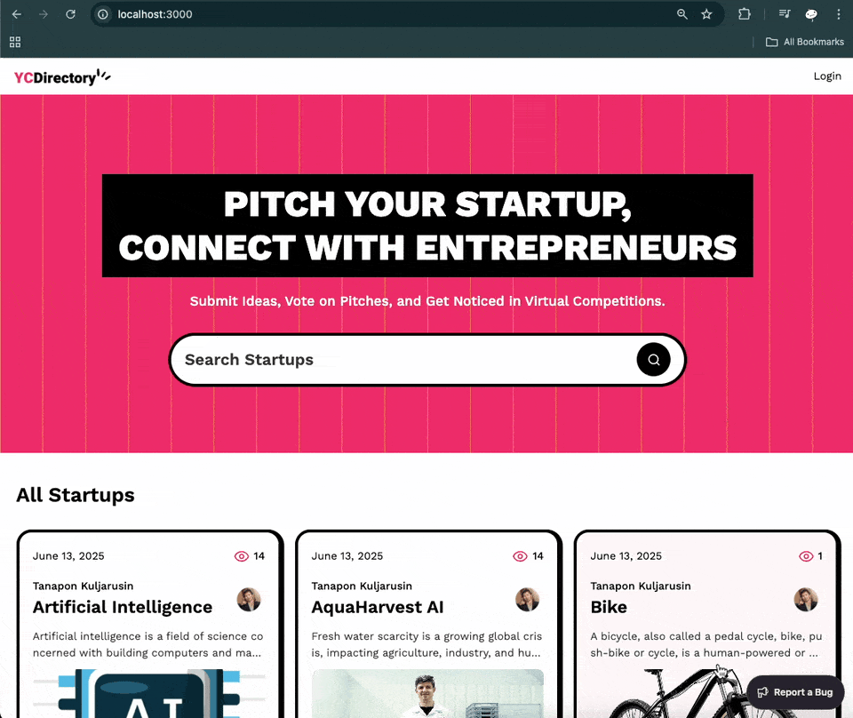
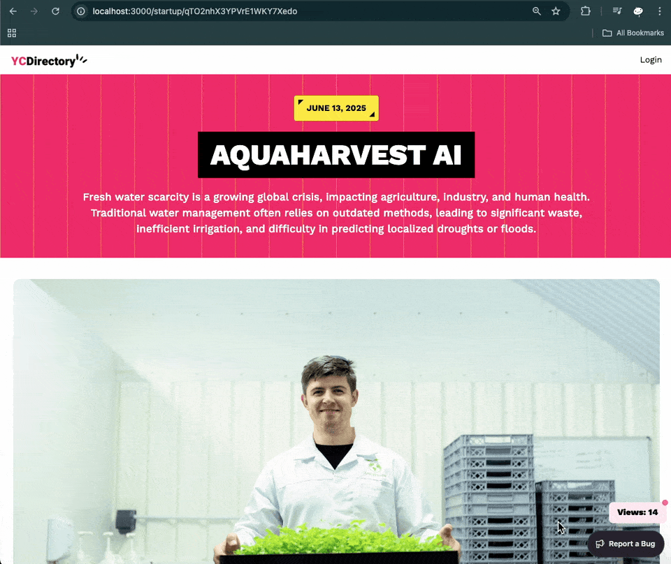
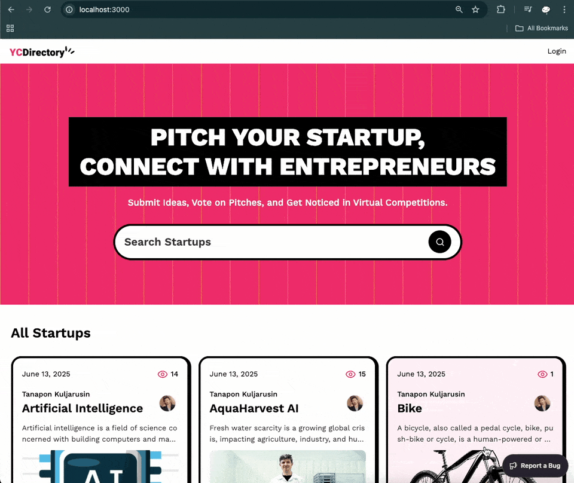
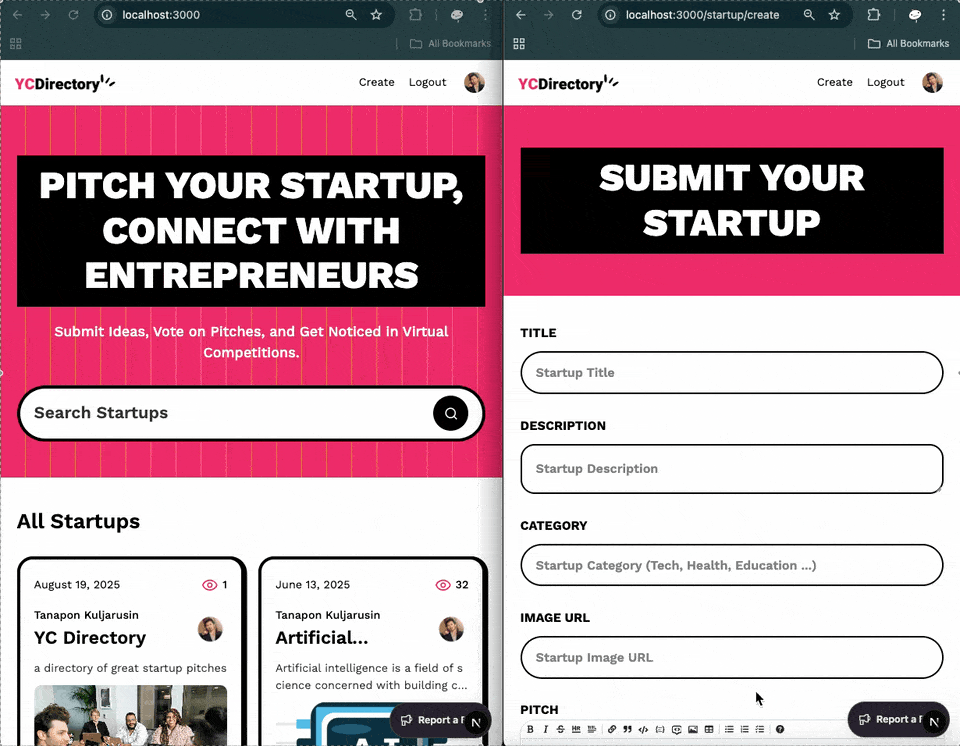

<h3 align="center">YC - Startup Directory Platform</h3>
<!-- TODO update related demo relate to live content api 1. create pitch to reflect in homepage -->
<!-- TODO update related demo relate to live content api 2. refresh pitch details page to reflect view counter in pitch in home page -->

## ⚠️ Note

This project was implemented based on a tutorial video on YouTube from JS Mastery [Next.js 15 Crash Course | Build and Deploy a Production-Ready Full Stack App](https://www.youtube.com/watch?v=Zq5fmkH0T78).

## Table of Contents

1. [Introduction](#introduction)
2. [Demo](#demo)
3. [Tech Stack](#tech-stack)
4. [Features](#features)
5. [Quick Start](#quick-start)
6. [What I learned](#learn)
7. [Implementation Notes](#note)

## <a name="introduction">Introduction</a>

Web application for a startup directory platform using Next.js with Github authentication, search functionality for pitches by category/title/author.

Just want to learn more about Next.js 15's features and Auth.js.

## <a name="demo">Demo</a>

### All users

#### Dashboard + Search by category + Search by title



#### Pitch Details + Editor Picks



### Authenticated User

#### Login ( First time will redirect to github oauth app)



#### User Profile


#### Live Content API Dashboard (Create new pitch/ View pitch details page/ Edit pitch in Sanity Studio)



## <a name="tech-stack">Tech Stack</a>

- React v19 - as a JS library
- Next.js v15 - as a React framework
- Auth.js v5 (known as NextAuth.js) - as an authentication tool
- Github Oauth App - as an authentication provider
- Sanity - as a headless CMS (Content Management System) which mean they provided backend, database(called datasets in Sanity and only 2 datasets in free tier), caching mechanism, and library to interact with Sanity.
- Tailwind CSS v4 - as a CSS framework
- ShadCN - as a UI component library
- TypeScript - as a type-checking tool
- zod - as a form validation tool
- Sentry - as an error tracking tool and performance monitoring tool

## <a name="features">Features</a>

- GitHub Authentication: Allows users to log in easily using their GitHub account and sync profile information into Sanity.

- Views Counter: Tracks the number of views for each pitch instead of an upvote system.

- Search: Search functionality to load and view pitches efficiently.

- Profile Page: Users can view the list of pitches they've submitted.
<!-- TODO for view counter -->
- Live Content API: Displays the latest startup ideas dynamically on the homepage using Sanity's Content API.

- Pitch Submission: Users can submit startup ideas, including title, description, category, and multimedia links ( image or video).

- Pitch Details Page: Click on any pitch to view its details, with multimedia and description displayed.

- Editor Picks: Admins can highlight top startup ideas using the "Editor Picks" feature managed via Sanity Studio.

## <a name="quick-start">Quick Start</a>

Follow these steps to set up the project locally on your machine.

### Prerequisites

- Git
- Node.js
- npm

### Cloning the Repository

```bash
git clone https://github.com/bank8426/try-next-nextauth-tailwind-sanity-sentry.git
cd try-next-nextauth-tailwind-sanity-sentry
```

### Installation

Install the project dependencies using npm:

```bash
npm install
```

### Set Up Environment Variables

1. Create a new file named `.env.development.local` and copy the content inside `.env.example`
2. Replace the placeholder values with your actual credentials

```env
AUTH_SECRET= # Added by `npx auth secret`. Read more: https://cli.authjs.dev
AUTH_GITHUB_ID= #From Github Oauth app
AUTH_GITHUB_SECRET= #From Github Oauth app
NEXT_PUBLIC_SANITY_PROJECT_ID= #From Sanity
NEXT_PUBLIC_SANITY_DATASET= #From Sanity
NEXT_PUBLIC_SANITY_API_VERSION="vX" #latest version
SANITY_WRITE_TOKEN= #From Sanity
SENTRY_AUTH_TOKEN= #From Sentry
```

**Running the Project**

```bash
npm run dev
```

Your server will run on [http://localhost:3000](http://localhost:3000/)

<!-- TODO -->

## <a name="learn">What I learned</a>

- React v19

  - Server Functions - Now React allow client component to call function that available on server side when form submitted or button clicked. So backed doesn't need to create API endpoint to handle form submission anymore. But this callback function must start with `"use server"` keyword. See more [here](https://react.dev/reference/rsc/server-functions)

    - in `form` element, You can add server function into `action` prop. and in case you want to track form input state and pending status when submit, you can use `useActionState` hook from `react`

    - in `button` element, You can add server function into `onClick` prop.

- Next.js 15

  - PPR (Partial Page Rendering) - It allow you to re-render the specific component that is affected by the change instead of the entire page. To use this feature, you need to add `export const experimental_ppr = true;` at the top of your page component and wrap your component with `React` `Suspense` component.

  - `after` function - It allow you to run function after the component is completly rendered. We use it to increase view count in this project.

- Sanity

  - They use query language called `GROQ` which has a different syntax than `SQL` and `graphQL`. And you need to create schema for your data model and use their `typegen` script to generate types and json based on your schema which will be used by Sanity Studio schema and GROQ query.
  - `useCdn` option is use to control whether to use the Content Delivery Network (CDN) or not. And since their `CDN` will `caching` your data which making it faster to load in case of high traffic. but it will need some time to reflect when the data is updated (60 seconds cache). But if you set `useCdn` to `false`, it will fetch data from Sanity directly every time which can be slower.
  - `Live Content API` is a feature that allow you to update your page in `real-time` when new/updated data is available in Sanity. By using `sanityFetch` to query data and `SanityLive` component from `next-sanity` package. It also means that it will send signal to page with `SanityLive` component to revalidate data and re-render the page.

- Auth.js
  - They already provide functions related to authentication process like `signIn`, `signOut`, `auth` based on provider that you selected. But you can also customise it to fit your needs.
  - It also act as middleware to check if user is authenticated or not.
  - OAuth flow between Auth.js and Github provider
    1. User click on login button
    2. Auth.js redirect to Github oauth app
    3. User agree to allow access to their profile information
    4. Auth.js call `signIn` in callback function with data provided by Github (Noted that different provider will provide different data format which will be important in case of supporting sigin in with multiple providers)
    5. Auth.js check if user is exist in Sanity
    6. Auth.js create user in Sanity if not exist.
    7. Auth.js redirect to dashboard

## <a name="note">Implementation Notes</a>

- Tailwind CSS

  - Since the tutorial video is published when `v3` still in use, but `v4` is out when I try to implement this project. So I need to update the code to match with `v4` and this change affect the structure of the project. Since many files are not needed any more like `tailwind.config` and `postcss.config`, some tailwind property name changed, use `@utility` instead of `@layer utilities` classes and more. You can see more detail in https://tailwindcss.com/docs/upgrade-guide. But for this project You can see below on what i did to make it work. (But honestly, just install tailwindcss v3 and it will work without headache)

    - Migration `Tailwind CSS v3` to `Tailwind CSS v4`

      - In `app/globals.css`
        1. Remove old import
        ```
        @tailwind base;
        @tailwind components;
        @tailwind utilities;
        ```
        2. In case of still using `tailwind.config.ts` in `v4`, add following import instead
        ```
        @import "tailwindcss"
        @config "./../tailwind.config.ts"
        ```
      - `!important` not working anymore, you need to add `!` in front of every property names you want to override.

- shadcn

  - `Toast` component is `deprecated`. But they have `sonner` package that provide functionality same as `Toast` component.
